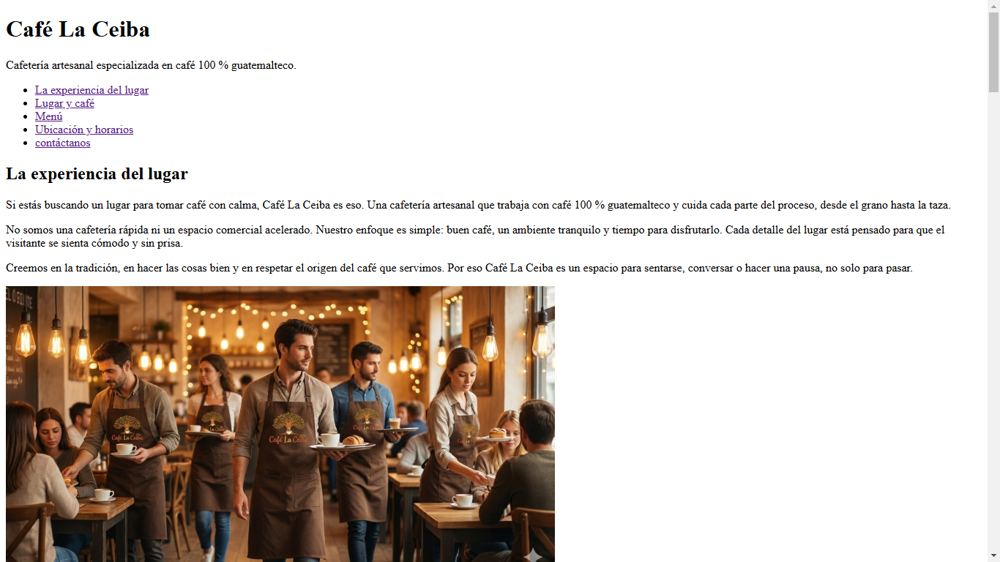
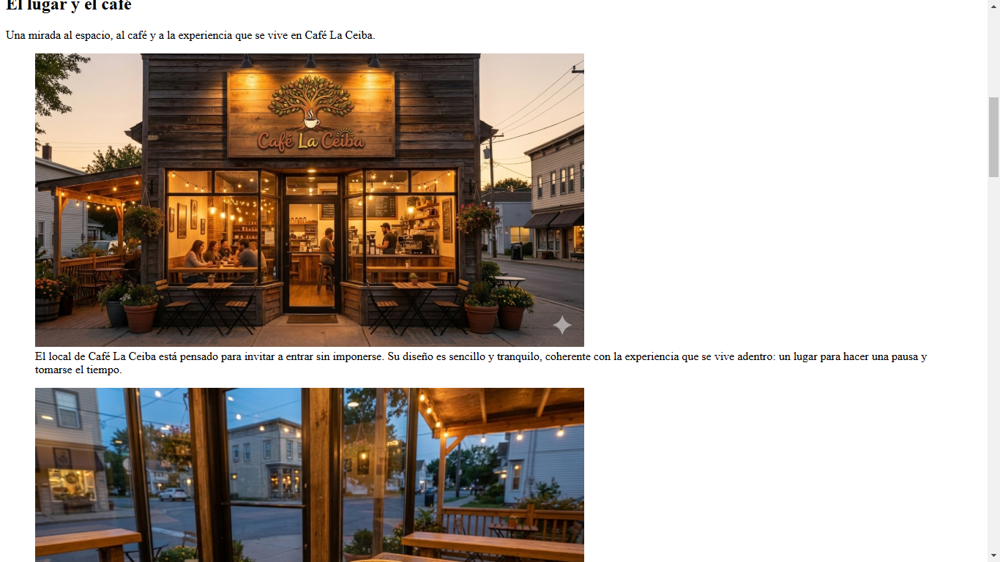
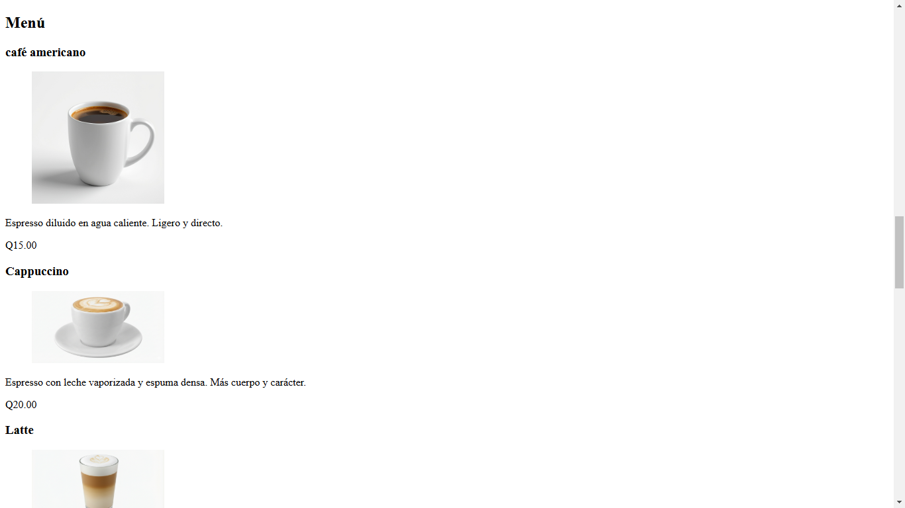

# Café La Ceiba Website

Informative website for the Guatemalan coffee shop **Café La Ceiba**.  
This project showcases the menu, location, opening hours, and a clean, responsive design using only HTML and CSS.

---

## 🚀 View Demo

[Click here to see the live website](https://yimix-dev.github.io/cafe-la-ceiba/)

---

## 📸 Screenshots

---

## 📖 About

Café La Ceiba Website is the official website of the Guatemalan coffee shop **Café La Ceiba**.  
Its purpose is to provide clear and attractive information about the café, including:  
- Drinks and desserts menu  
- Location and opening hours  
- The overall customer experience offered by the café  

The design is clean and minimalist, focused on providing easy navigation and a professional presentation of the business.

---

## 📝 Project Description

- Static, purely informational website with no e-commerce or dynamic features.
- Clean, minimalist design focused on clarity and user experience.
- Created with pure HTML and CSS to demonstrate solid fundamentals and semantic structure.
- Designed as a real business website for a local coffee shop in Guatemala.

---

## 📌 Technologies Used

- HTML5  
- CSS3  
- Git & GitHub for version control

---

## ⚡ Author

**Yimix** – [GitHub Profile](https://github.com/yimix-dev)
